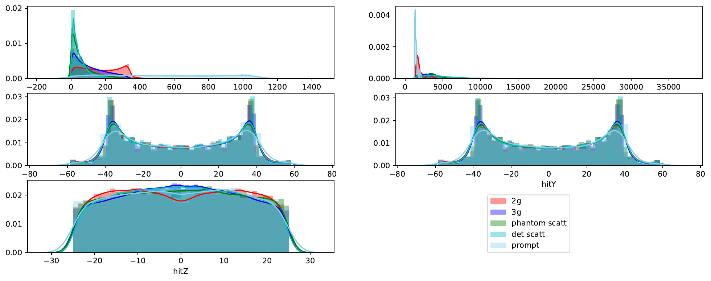
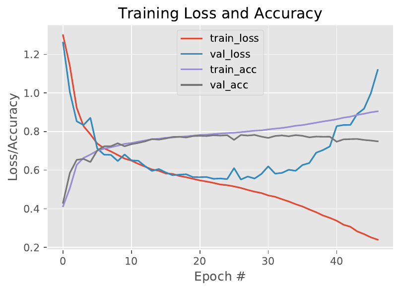
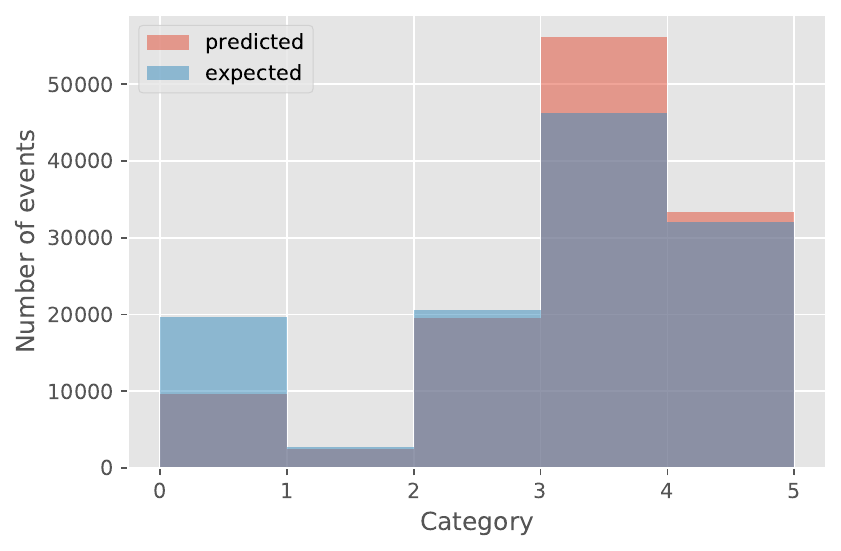

# Classification of PET events

## Software information

Repository contains an example of event classification  gathered by the Jagiellonian Positron Emission  Tomograph (J-PET).
Collected events can not be easily separated into main categories (see figures below). 

  

However, simple implementation of LSTM network allows to obtain accuracy of around 80%,
and preform a fast classification of main types of observed events.

  
  

Right now program takes as an input files generated by  [JPetGeant4](https://github.com/JPETTomography/J-PET-geant4) software.

## Usage example
Analysis example is presented in usage_example.ipynb Jupyter notebook. 

## How to get data?
Small sample of data is included in data folder. 
If you would like to test the learning on the greater statistics or different detector configuration, then
please visit the [JPetGeant4](https://github.com/JPETTomography/J-PET-geant4) project webpage.

## System requirements
- python 3.7
- tensorflow 2.0 & keras
- [uproot](https://github.com/scikit-hep/uproot)
- Jupyter
- numpy
- matplotlib
- pandas
- seaborn
- sklearn

### Support \& bug reporting 
If you have any question or comment please write to  Daria Kisielewska <dk.dariakisielewska.com>.

